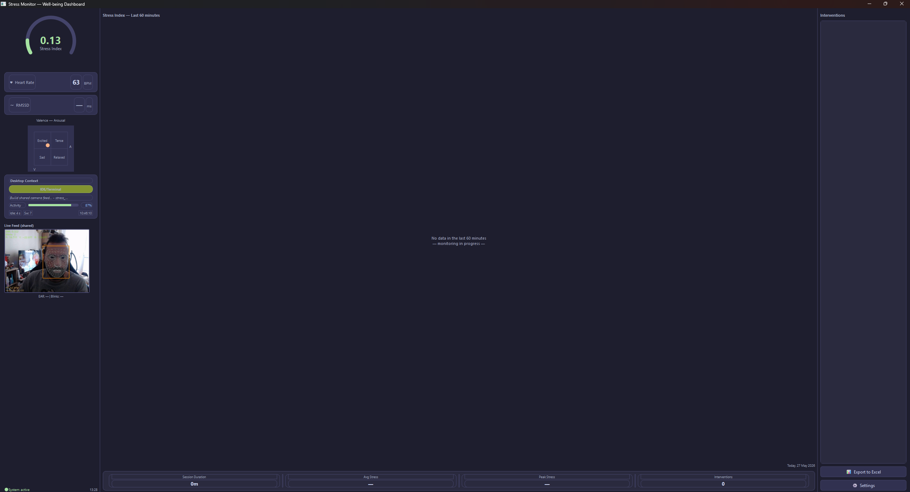

# Multimodal Stress Detection & Mental Well-being Support System

**MSc Thesis — Completed Integrated System**
Dimitris Moforis · Department of Digital Systems · University of Piraeus
Supervisor: Professor Andreas Menychtas
Student ID: ME2457

---

## Overview

This system detects cognitive stress in real time by fusing three independent data streams — physiological signals extracted remotely from the webcam, continuous facial expression analysis, and desktop behavioural context — and delivers personalised well-being recommendations via a locally hosted large language model.

Designed for knowledge workers (students, developers, analysts) who spend extended hours at a computer. All processing is fully local: no video, audio, or raw biometric data leaves the machine. Only extracted numerical features are stored in a local SQLite database.

Stress scoring is individually calibrated: a two-minute resting baseline session records the user's personal HR, RMSSD, EAR, blink rate, valence, and arousal. The late fusion layer uses these personal values instead of fixed population thresholds. When one of six pre-defined conditions is met — sustained high stress, disengagement, negative affect, eye strain, prolonged inactivity, or positive flow — the system generates a contextual natural-language recommendation via Llama 3.1 8B (Ollama) and delivers it as a Windows desktop toast notification.

**Primary output:** a `stress_index` in [0, 1] computed every five minutes, together with continuous valence and arousal estimates that characterise the user's emotional state on the Russell (1980) circumplex model of affect. Emotion quadrant labels (Excited/Alert, Calm/Content, Tense/Stressed, Sad/Fatigued) are inferred from the VA coordinates and displayed in the dashboard.

| Modality | Data source | Key signals |
|----------|-------------|-------------|
| Physiological | Webcam (rPPG) | Heart rate (BPM), RMSSD, LF/HF ratio |
| Facial analysis | Webcam (MediaPipe + EmoNet-8) | Blink rate, EAR, head pose, valence, arousal, emotion label |
| Desktop context | Windows OS (Flutter + win32) | Active window, keyword-classified live category (LLM available offline), idle time, activity %, window switches |

---

## Installation

See **[INSTALL.md](INSTALL.md)** for complete step-by-step setup instructions covering Python environment, CUDA PyTorch, Ollama, Flutter build, and baseline calibration.

**Quick start** — if Python 3.12, Ollama, and Flutter are already installed:

```powershell
python -m venv venv
venv\Scripts\Activate.ps1
pip install -r requirements.txt
ollama serve                                 # separate terminal, keep running
python src\utils\baseline.py --calibrate    # first run only — 2-minute resting session
python dashboard.py --start-backend
```

---

## System Architecture

```
                        SHARED CAMERA FEED
                   src/camera/shared_feed.py
                   (single OpenCV capture thread)
                              |
               +--------------+--------------+
               v              v              v
       +-------------+ +------------+ +-------------------+
       |   PHYSIO    | |    FACE    | |      DESKTOP      |
       | rppg_monitor| |face_monitor| |  Flutter + win32  |
       |             | |            | |  (subprocess)     |
       | HR  / 10 s  | | EAR, blink | |  active window    |
       | HRV / 5 min | | head pose  | |  LLM category     |
       |             | | valence    | |  idle time        |
       |             | | arousal    | |  activity %       |
       +------+------+ +-----+------+ +--------+----------+
              |              |                  |
              v              v                  v
       physio_readings   face_readings    desktop_readings
                  \           |            /
                   \          |           /
                    v         v          v
              +-------------------------------+
              |   AGGREGATOR  (every 5 min)   |
              |   src/fusion/aggregator.py    |
              +---------------+---------------+
                              |
                              v
                   +----------------------+
                   |    LATE FUSION       |
                   |  physio  × 0.40      |
                   |  face    × 0.40      |
                   |  desktop × 0.20      |
                   +----------+-----------+
                              |  stress_index
                              v
                   +----------------------+
                   |  INTERVENTION ENGINE |
                   |  6 trigger conditions|
                   |  Llama 3.1 8B        |
                   |  (Ollama, GPU-local) |
                   |  → Windows toast     |
                   +----------+-----------+
                              |
                              v
                   +----------------------+
                   |   PyQt6 DASHBOARD    |
                   |   dashboard.py       |
                   |   (primary UI)       |
                   +----------------------+
```

---

## Modules

| Module | File | Purpose |
|--------|------|---------|
| Root launcher | `dashboard.py` | Single entry point — starts the PyQt6 dashboard and optionally launches the monitoring backend as a background subprocess |
| Shared camera feed | `src/camera/shared_feed.py` | Single OpenCV capture thread distributing frames to all consumers; eliminates exclusive-access conflicts |
| Physio monitor | `src/physio/rppg_monitor.py` | rPPG → BVP signal → HR every 10 s, full HRV every 5 min |
| HRV processor | `src/physio/hrv_processor.py` | RMSSD computation and plausibility validation (5–80 ms bounds, HR cross-validation) |
| Face monitor | `src/face/face_monitor.py` | MediaPipe 468-landmark mesh → EAR, blink rate, head pose every 30 s; writes annotated preview frame to shared JPEG for dashboard |
| Valence-Arousal | `src/face/valence_arousal.py` | EmoNet-8 (Toisoul et al., 2021) → continuous valence and arousal from face crop |
| Emotion labels | `src/utils/emotion_labels.py` | Maps VA coordinates to Russell (1980) circumplex quadrant labels |
| Desktop monitor | `src/desktop/lib/main.dart` | Flutter + win32 → active window title, keyword-classified live category (LLM available offline), idle time, activity %, window switches |
| LLM classifier | `src/llm/classifier.py` | Llama 3.1 8B classifies window titles into nine activity categories; LRU-cached; keyword fallback |
| LLM recommender | `src/llm/recommender.py` | Generates contextual natural-language recommendations; per-trigger guidance injected into prompt; template fallback |
| Aggregator | `src/fusion/aggregator.py` | Background thread; merges raw readings into 5-min summary windows; evaluates all six intervention trigger conditions |
| Late fusion | `src/fusion/late_fusion.py` | Weighted combination of per-modality stress scores; missing modalities are excluded and remaining weights renormalised |
| Notifier | `src/wellbeing/notifier.py` | Windows desktop toast notifications (windows-toasts / WinRT); logs every delivery to `interventions` table |
| Baseline calibrator | `src/utils/baseline.py` | 2-minute resting session recording personal HR, RMSSD, EAR, blink rate, valence, and arousal |
| Dashboard UI | `src/ui/dashboard.py` | PyQt6 three-panel dashboard: stress gauge, VA scatter, trend graph, intervention log, settings, live camera feed |

---

## Prerequisites

> **First time-** See [INSTALL.md](INSTALL.md) for complete setup instructions.

Required tools: Python 3.12, Flutter SDK 3.x, Visual Studio 2022 with **Desktop development with C++**, Ollama. An NVIDIA GPU is recommended for EmoNet-8 and Llama inference.

Key Python packages (installed via `requirements.txt`):

| Package | Purpose |
|---------|---------|
| `open-rppg` | rPPG heart rate and BVP extraction |
| `mediapipe` | Real-time face landmark detection (468 points) |
| `torch`, `torchvision` | EmoNet-8 valence-arousal inference |
| `ollama` | Local LLM client (Llama 3.1 8B) |
| `heartpy` | HRV signal processing and RMSSD computation (via open-rppg pipeline) |
| `opencv-python` | Camera capture and frame annotation |
| `PyQt6`, `pyqtgraph` | Dashboard UI and real-time trend plots |
| `pandas`, `openpyxl` | Excel export |
| `windows-toasts` | Native Windows 10/11 toast notifications (WinRT) |
| `colorama` | Colour-coded terminal output for daily summaries |

---

## Running the System

### Step 1 — Personal baseline calibration (first run only)

Collect two minutes of resting physiological data to personalise the stress scoring. Sit comfortably in front of the camera and remain relaxed.

```powershell
python src/utils/baseline.py --calibrate
```

The calibrator records your resting HR, RMSSD, EAR, blink rate, valence, and arousal, and stores them in the `baselines` table. The late fusion layer uses these personal values for all subsequent sessions. Re-run if your resting conditions change significantly (e.g. after illness or a change in environment).

To inspect the currently stored baseline:

```powershell
python src/utils/baseline.py --show
```

If no baseline exists when the dashboard opens, a welcome dialog will prompt you to run the calibration.

### Step 2 — Start Ollama (separate terminal)

```powershell
ollama serve
```

### Step 3 — Launch the system

The single recommended launch command starts everything:

```powershell
python dashboard.py --start-backend
```

This command:
1. Opens the **PyQt6 dashboard** as the primary interface
2. Starts `run_all.py --no-ui` as a background subprocess — all three modalities begin collecting data immediately
3. Launches the **Flutter desktop monitor** headlessly (its window is suppressed via Win32; data continues to be written)

To close: close the dashboard window, or press **Ctrl+C** in the terminal. All background processes are terminated automatically.

### Alternative launch modes

```powershell
# Dashboard only — connect to an already-running backend
python dashboard.py

# Backend only — no dashboard (original headless mode)
python run_all.py --no-ui

# Full backend with preview window — useful for debugging
python run_all.py
```

---

## Dashboard UI

The PyQt6 dashboard is the primary interface for monitoring sessions.



*Dashboard showing stress gauge (0.17), HR card (68 BPM), Valence–Arousal scatter, live face feed with MediaPipe mesh and rPPG bounding box, Settings panel, 60-minute stress trend graph with HH:MM time axis, and session stats bar.*

### Layout

| Panel | Content |
|-------|---------|
| **Left (280 px)** | Stress gauge (arc-style, colour-coded 0–1), HR card, HRV (RMSSD) card, Valence–Arousal scatter with quadrant labels, Desktop context card, Live camera feed (face mesh overlay), system status dot |
| **Centre (flex)** | 60-minute stress trend (pyqtgraph with HH:MM time axis, pinned 0–1 Y range), no-data placeholder when monitoring is starting, session stats bar (duration · avg stress · peak stress · interventions), date label |
| **Right (260 px)** | Colour-coded intervention history (last 15 entries), Export to Excel button, Settings button |

### Settings

Click **âš™ Settings** in the right panel to adjust:

- **Dark / light mode** — persisted across sessions via `QSettings`
- **Dashboard refresh interval** — 10–120 s (default 30 s)
- **Notification cooldown** — 5–60 min (default 15 min); written to `config.py` and takes effect on the next session
- **Baseline calibration** — launches the 2-minute resting session in a terminal window

### Live camera feed

When launched with `--start-backend`, the camera feed panel in the left column displays the annotated frame written by `run_all.py` (face mesh overlay, EAR, blink count, head pose, rPPG bounding box, HR and stress index). The file is updated every 5th processed frame (~15 FPS source / ~5 FPS display) using an atomic write pattern (`os.replace`) to prevent corrupt-JPEG artefacts. A green border indicates a face was detected within the last 30 seconds.

### First-launch splash

If no personal baseline exists when the dashboard opens, a welcome dialog invites the user to run the 2-minute resting calibration before starting their first session.

---

## Intervention Trigger System

The aggregator evaluates six independent trigger conditions after each 5-minute window. Any condition being met fires an intervention (subject to the per-type cooldown):

| Trigger | Condition | Cooldown |
|---------|-----------|----------|
| `high_stress` | `stress_index` > 0.65 for 2 consecutive windows | 15 min |
| `disengagement` | Low activity % + high idle time for 2 consecutive windows | 15 min |
| `negative_affect` | Mean valence < −0.35 for 2 consecutive windows | 15 min |
| `eye_strain` | EAR consistently below resting baseline for 2 consecutive windows | 15 min |
| `prolonged_idle` | Continuously idle for 3 consecutive windows | 15 min |
| `positive_flow` | High activity + positive valence (positive reinforcement) | 30 min, once per session |

Counters persist across cooldown periods: if a condition is met at the start of a cooldown, the intervention fires immediately when the cooldown expires. All trigger conditions and counter states are logged; intervention messages are stored in the `interventions` table.

---

## Data Collection

### Aggregation cycle

The system operates on a five-minute rolling window:

1. **Raw extraction** — physio, face, and desktop modules write continuously: HR every 10 s; face metrics every 30 s; desktop metrics every 30 s.
2. **Window aggregation** — the Aggregator reads all raw rows from the preceding window and computes per-modality summary statistics (mean HR, mean RMSSD, mean valence/arousal, dominant app category, total window switches, etc.).
3. **Fusion scoring** — `LateFusion` combines per-modality summaries into `stress_index` ∈ [0, 1], weighted physio × 0.40, face × 0.40, desktop × 0.20. Modalities with no data in the window are excluded and remaining weights are renormalised. Physio and face scores are computed as deviations from the user's personal resting baseline.
4. **Intervention check** — the aggregator evaluates all six trigger conditions and, if any fires, requests a recommendation from Llama 3.1 8B and delivers it as a Windows toast notification.

All four steps are fully automatic once the system is running. The `aggregated_windows` table is the primary analysis unit for the thesis.

### Data quality check

```powershell
python -c "from src.utils.db import data_health_check; data_health_check()"
```

Prints row counts for all tables, rPPG signal quality statistics, RMSSD plausibility metrics, desktop timestamp format distribution, and modality coverage per aggregated window.

### Session review

```powershell
python daily_summary.py                      # today
python daily_summary.py --date 2026-05-18    # specific date
```

Prints colour-coded statistics — stress index, heart rate, valence and arousal with quadrant interpretation, dominant app category, total window switches, and triggered interventions — to the terminal. A plain-text copy is saved to `data/exports/daily_summary_YYYY-MM-DD.txt`.

---

## Viewing and Exporting Data

### Terminal data viewer

```powershell
python view_data.py            # last 5 readings per module
python view_data.py --rows 10  # last N readings
python view_data.py --all      # full database dump
```

### Excel export

Exports all collected data to a multi-sheet workbook for descriptive statistics and correlation analysis.

```powershell
python export_excel.py                     # all data
python export_excel.py --date 2026-05-01   # specific date
python export_excel.py --last 7            # last 7 days
```

Output: `data/exports/stress_analysis_<date>.xlsx`

| Sheet | Contents |
|-------|----------|
| Raw Physio | All `physio_readings` rows |
| Raw Face | All `face_readings` rows |
| Raw Desktop | All `desktop_readings` rows |
| 5-Min Windows | `aggregated_windows` — primary analysis sheet |
| Interventions | All recommendations delivered to the user |
| Correlations | Correlation matrix between key stress indicators |
| Summary Stats | Descriptive statistics per variable |

### Test suite

```powershell
pytest tests/ -v   # 99 tests
```

---

## Data Schema

All modules write to `data/stress_monitor.db` (SQLite, WAL journal mode):

```sql
-- Physiological readings (rPPG)
-- window_type: 'hr_10s' (every 10 s) or 'hrv_5min' (every 5 min)
CREATE TABLE physio_readings (
    id             INTEGER PRIMARY KEY AUTOINCREMENT,
    timestamp      TEXT NOT NULL,
    heart_rate     REAL,   -- BPM
    rmssd          REAL,   -- ms  (hrv_5min rows only; validated 5–80 ms)
    lf_hf_ratio    REAL,   -- frequency-domain HRV (hrv_5min rows only)
    sdnn           REAL,   -- ms
    signal_quality REAL,   -- 0–1 (open-rppg SQI)
    window_type    TEXT
);

-- Facial analysis (MediaPipe + EmoNet-8)
CREATE TABLE face_readings (
    id                INTEGER PRIMARY KEY AUTOINCREMENT,
    timestamp         TEXT NOT NULL,
    blink_rate        REAL,   -- blinks/min
    mean_ear          REAL,   -- Eye Aspect Ratio 0–1
    pitch_deg         REAL,   -- head tilt up/down (degrees)
    yaw_deg           REAL,   -- head turn left/right (degrees)
    roll_deg          REAL,   -- head tilt left/right (degrees)
    face_detected_pct REAL,   -- % of 30-s window with face visible
    valence           REAL,   -- −1 (unpleasant) to +1 (pleasant)
    arousal           REAL,   -- −1 (drowsy) to +1 (alert)
    emotion_label     TEXT    -- Russell (1980) quadrant label
);

-- Desktop context (Flutter + win32)
CREATE TABLE desktop_readings (
    id               INTEGER PRIMARY KEY AUTOINCREMENT,
    timestamp        TEXT NOT NULL,
    active_window    TEXT,
    app_category     TEXT,   -- keyword-classified activity type (LLM available offline)
    idle_seconds     REAL,
    activity_pct     REAL,   -- % of window with keyboard/mouse input
    window_switches  INTEGER
);

-- 5-minute aggregated windows (primary analysis unit)
CREATE TABLE aggregated_windows (
    id                      INTEGER PRIMARY KEY AUTOINCREMENT,
    window_start            TEXT NOT NULL,
    window_end              TEXT NOT NULL,
    avg_hr                  REAL,
    avg_rmssd               REAL,
    avg_lf_hf               REAL,
    avg_blink_rate          REAL,
    avg_ear                 REAL,
    avg_valence             REAL,
    avg_arousal             REAL,
    avg_pitch               REAL,
    avg_yaw                 REAL,
    dominant_category       TEXT,
    avg_activity_pct        REAL,
    avg_idle_seconds        REAL,
    total_window_switches   INTEGER,
    stress_index            REAL,    -- 0–1
    intervention_triggered  INTEGER  -- 0 or 1
);

-- Personal resting baseline (calibrated per user)
CREATE TABLE baselines (
    id          INTEGER PRIMARY KEY AUTOINCREMENT,
    timestamp   TEXT NOT NULL,
    hr          REAL,   -- resting heart rate (BPM)
    rmssd       REAL,   -- resting RMSSD (ms)
    ear         REAL,   -- resting Eye Aspect Ratio
    blink_rate  REAL,   -- resting blink rate (blinks/min)
    valence     REAL,   -- resting valence (−1 to +1)
    arousal     REAL    -- resting arousal (−1 to +1)
);

-- Delivered intervention recommendations
CREATE TABLE interventions (
    id             INTEGER PRIMARY KEY AUTOINCREMENT,
    timestamp      TEXT NOT NULL,
    trigger_reason TEXT,   -- one of six trigger condition keys
    message        TEXT,
    stress_index   REAL,
    valence        REAL,
    arousal        REAL,
    delivered      INTEGER DEFAULT 1
);

CREATE TABLE user_feedback (
    id              INTEGER PRIMARY KEY AUTOINCREMENT,
    intervention_id INTEGER REFERENCES interventions(id),
    timestamp       TEXT NOT NULL,
    rating          INTEGER CHECK(rating BETWEEN 1 AND 5),
    comment         TEXT
);
```

---

## Design Principles

- **Privacy-by-design** — no video, audio, or screenshots are stored; only extracted numerical features written to a local SQLite database
- **Local-first** — all inference (rPPG, MediaPipe, EmoNet-8, Llama 3.1) runs on-device; no network calls after the initial model download
- **Personal baseline** — stress scoring uses individual resting measurements rather than fixed population thresholds; re-calibration is supported at any time
- **Graceful degradation** — each modality is independent; if data is unavailable the modality weight drops to zero and remaining weights are renormalised automatically
- **Modularity** — each module has a single responsibility and is independently testable; 99 automated tests cover the fusion layer, HRV computation, EAR formula, database helpers, LLM comparison, and evaluation helpers

---

## Known Limitations

| Limitation | Detail |
|------------|--------|
| Roll° head pose instability | The atan2 Euler decomposition exhibits instability at extreme pitch angles (beyond ±60°). Roll° readings in those regions should be treated as unreliable. |
| LF/HF at short windows | Frequency-domain HRV requires at least 5 minutes of clean signal. LF/HF values will be `NULL` during the early phase of each session. |
| rPPG signal quality | rPPG SQI under typical office lighting is approximately 0.35–0.50. HRV metrics are suppressed when SQI < 0.5. Stable frontal lighting and avoiding rapid head movements improve signal quality. |
| Dashboard JPEG warnings | The terminal may show occasional "Corrupt JPEG data: premature end of data segment" warnings from the camera feed widget. These are cosmetic only — the atomic write pattern (`os.replace`) eliminates data corruption; Qt occasionally reads a frame before the file metadata is fully flushed. Data collection is not affected. |
| Desktop window classification | The Flutter subprocess writes `app_category` using keyword-based rules (Dart cannot call the Python Ollama client at runtime). The Python `src/llm/classifier.py` module is available for offline re-classification of stored window titles but is not invoked during live monitoring. |
| First-launch calibration restart | First-launch calibration requires a dashboard restart after completion due to camera resource conflict between the calibration module and the monitoring backend subprocess. |
| LLM evaluation judge model | `src/evaluation/llm_evaluator.py` requires Gemma 4:12b (~7.6 GB) available via Ollama (`ollama pull gemma4:12b`). This model is only needed for post-hoc evaluation by the researcher — end users do not require it for normal system operation. |

---

## Repository Structure

```
stress_detection/
├── SPEC.md                            ← full technical specification
├── README.md                          ← this file
├── requirements.txt
├── dashboard.py                       ← root launcher (PRIMARY ENTRY POINT)
├── run_all.py                         ← backend launcher (all modules, headless)
├── view_data.py                       ← terminal database viewer
├── export_excel.py                    ← Excel export script
├── daily_summary.py                   ← colour-coded daily summary
│
├── data/
│   ├── stress_monitor.db              ← shared SQLite database (WAL mode)
│   ├── exports/                       ← Excel workbooks and daily summary txt files
│   └── models/                        ← cached model weights (EmoNet-8)
│
├── docs/
│   └── screenshots/
│
├── src/
│   ├── camera/
│   │   └── shared_feed.py             ← single OpenCV capture thread
│   │
│   ├── physio/
│   │   ├── rppg_monitor.py            ← HR every 10 s, HRV every 5 min
│   │   └── hrv_processor.py           ← RMSSD computation and validation
│   │
│   ├── face/
│   │   ├── face_monitor.py            ← EAR, blink rate, head pose (30 s); shared frame file
│   │   └── valence_arousal.py         ← EmoNet-8 continuous VA prediction
│   │
│   ├── desktop/
│   │   └── lib/main.dart              ← Flutter desktop context monitor
│   │
│   ├── llm/
│   │   ├── classifier.py              ← Ollama window-title classification (9 categories)
│   │   └── recommender.py             ← Ollama recommendation generation (6 trigger types)
│   │
│   ├── fusion/
│   │   ├── late_fusion.py             ← weighted per-modality score combination
│   │   └── aggregator.py             ← 5-minute aggregation + 6-trigger intervention engine
│   │
│   ├── wellbeing/
│   │   └── notifier.py                ← Windows desktop toast notifications
│   │
│   ├── ui/
│   │   └── dashboard.py              ← PyQt6 three-panel dashboard
│   │
│   └── utils/
│       ├── db.py                      ← shared SQLite helpers (WAL, row factory)
│       ├── config.py                  ← all configuration constants
│       ├── baseline.py                ← personal baseline calibration
│       └── emotion_labels.py          ← Russell (1980) VA → emotion label mapping
│
└── tests/                             ← 99 tests
    ├── conftest.py                    ← shared fixtures
    ├── test_ear.py                    ← EAR formula and blink detection
    ├── test_hrv.py                    ← RMSSD computation and validation
    ├── test_fusion.py                 ← LateFusion scoring and weight renormalisation
    ├── test_aggregator.py             ← 6-trigger intervention logic
    ├── test_db.py                     ← database helpers and timestamp normalisation
    └── test_emotion_labels.py         ← Russell (1980) VA → emotion label mapping
```

---

## Screenshots

### PoC #1 — Physiological Signals (rPPG)

Heart rate and HRV extraction from the webcam using remote photoplethysmography. No wearable device required.


---

### PoC #2 — Facial Landmark Analysis

MediaPipe Face Mesh detecting 468 landmarks per frame. Extracts Eye Aspect Ratio, blink rate, and head pose (pitch, yaw, roll).


---

### PoC #3 — Desktop Context Monitor

Flutter native Windows application monitoring active window, keyword-classified application category (LLM available for offline analysis), idle time, and activity percentage.


---

### PoC #4 — Unified Launcher and Data Viewer

Combined `run_all.py` launcher with all PoC modules active, and the `view_data.py` summary table.


---

### Integrated System (Phase 2)

#### Unified PyQt6 Dashboard

The primary interface launched via `python dashboard.py --start-backend`. The left panel shows the stress gauge (0.17), heart rate (68 BPM), RMSSD, Valence–Arousal scatter, Desktop context card, and the live camera feed with MediaPipe face mesh and rPPG bounding box. The centre panel shows the 60-minute stress trend graph with HH:MM time axis and the session stats bar (13 min · avg 0.17 · peak 0.18 · 0 interventions). The Settings panel is open, showing the dark mode toggle, notification cooldown slider, and calibration button. The green "System active" dot is visible bottom-left.


---

#### Personal Baseline Calibration

The two-minute resting calibration session (`python src/utils/baseline.py --calibrate`). The preview window overlays the real-time face mesh, live EAR reading (0.335), blink count, head pose angles, and a countdown timer. Collected averages are saved to the `baselines` table and used by the fusion layer for all subsequent sessions.


---

#### All Three Modules Running Simultaneously

The original `run_all.py` integration test confirming all three modalities — physio (rPPG), face (MediaPipe), and desktop (Flutter) — operating concurrently on a shared camera feed with no resource conflicts.


---

## Academic References

1. **Soukupova & Cech (2016)** — Real-time eye blink detection using facial landmarks. *21st Computer Vision Winter Workshop.*
2. **Schmidt et al. (2018)** — Introducing WESAD, a multimodal dataset for wearable stress and affect detection. *Proceedings of ICMI 2018.*
3. **Makowski et al. (2021)** — NeuroKit2: a Python toolbox for neurophysiological signal processing. *Behavior Research Methods, 53*, 1689–1178.
4. **Toisoul et al. (2021)** — Estimation of continuous valence and arousal levels from faces in naturalistic conditions. *Nature Machine Intelligence, 3*, 42–50.
5. **Russell (1980)** — A circumplex model of affect. *Journal of Personality and Social Psychology, 39*(6), 1161–1178.

---

*University of Piraeus · Department of Digital Systems*
*MSc Programme: Information Systems & Services*
